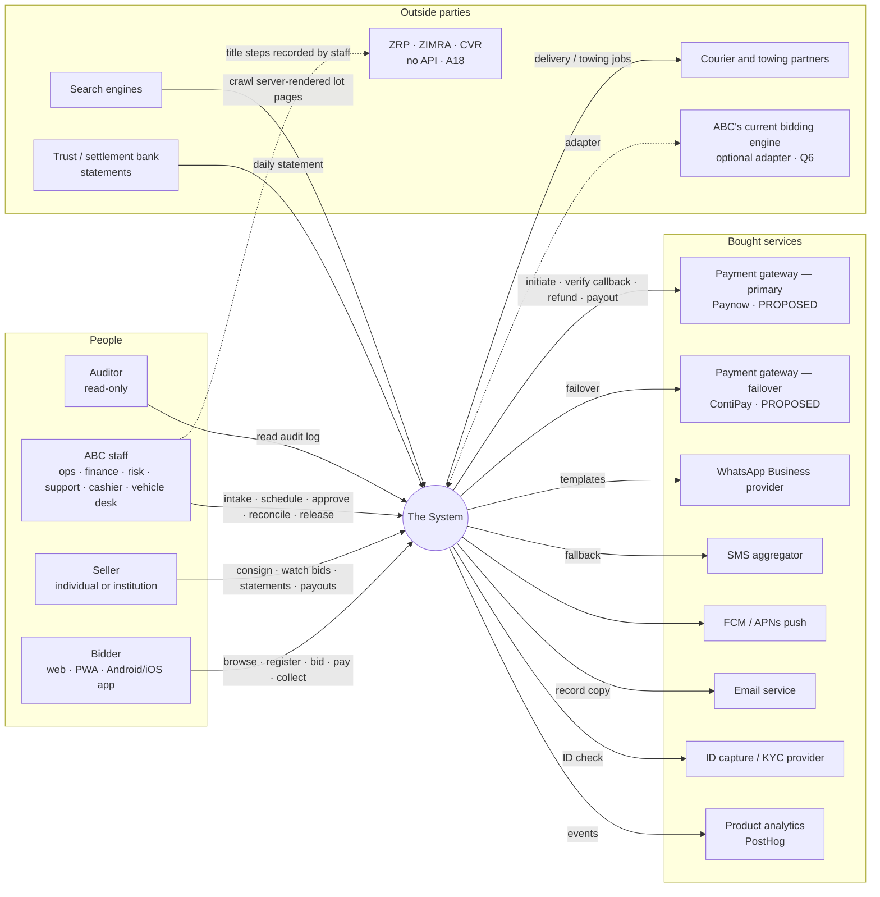
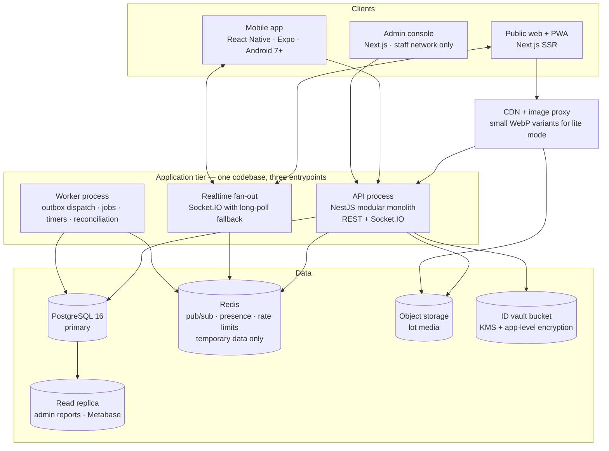
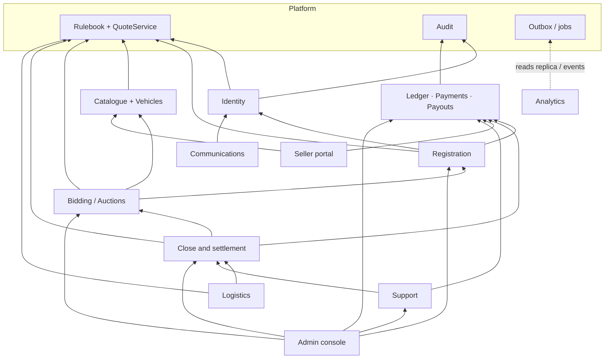
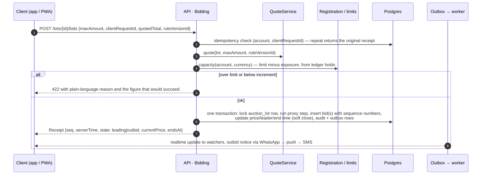
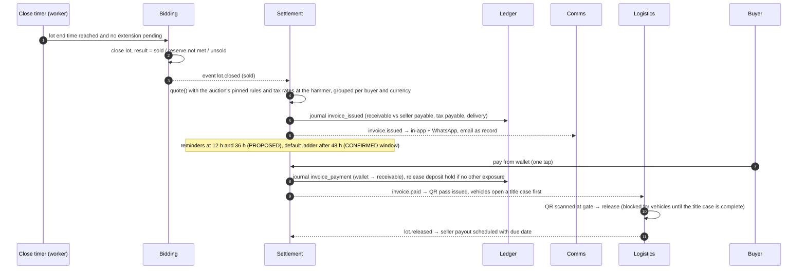
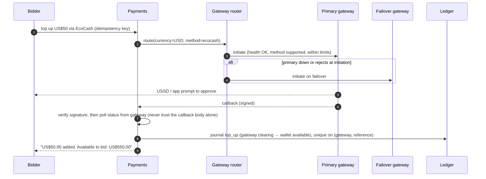

# 01 — Solution Architecture

| | |
|---|---|
| Phase | 0 — Foundations (deliverable 2) |
| Source of truth | The blueprint (§ references), [00 Assumptions register](00-assumptions-register.md) |
| Related | [02 Data model](02-data-model.md) · DDL in [`db/schema.sql`](../db/schema.sql) |
| Tags | CONFIRMED · BENCHMARK · PROPOSED · ASSUMPTION, as defined in [00](00-assumptions-register.md#how-to-read-this-register) |

## 1. What the System is for

The System turns a binding bid into an **informed, funded and quickly settled** one (blueprint §5). It keeps ABC's timed auction (proxy bids, soft close, staggered ends; CONFIRMED features) and rebuilds what surrounds it: admission of bidders, information before a binding bid, movement of money, and the seller's view of their goods selling.

Every feature must pass the blueprint's test: **does it shorten time to cash for the seller, or lower regret for the buyer?** §12 applies that test to this architecture.

### Four architecture rules (non-negotiable)

| # | Rule | Where it is enforced |
|---|---|---|
| R1 | **One wallet ledger.** Double-entry, append-only, with USD and ZiG kept apart. Every movement of money is a ledger journal. No module holds its own balance | Ledger module is the only writer of `ledger.*`. Database triggers reject `UPDATE`/`DELETE`, unbalanced journals and mixed-currency journals ([02 §4](02-data-model.md#4-wallet-and-ledger)) |
| R2 | **One rulebook.** Every figure a user sees (limit, fee, tax, deadline, soft close, increment) comes from the same rulebook and quote service the invoice engine uses. Versioned with effective dates | Rulebook platform service plus `QuoteService` (§4.3). Commit screen and invoice engine call the same function with the same rule version |
| R3 | **Append-only audit.** Every state change on a bid, payment or lot is logged with server time, actor and reason. Staff overrides need name and reason, and a second approver above a threshold (A15) | Generic audit trigger on every stateful table; `audit.override_request` with a database check that requester ≠ approver |
| R4 | **Idempotency everywhere.** Payments by gateway reference; bids by client request ID; notifications by (message, channel, recipient) | Unique constraints in the database, not just application checks ([02 §8](02-data-model.md#8-invariants-and-where-they-are-enforced)) |

## 2. System context



**Design stance on external parties**

- Everything in *Bought services* sits behind an interface owned by the System (§7). Two gateways and two currencies are designed in from day one, because retrofitting them is the project's largest single risk.
- Title agencies are people-and-paper steps (A18). The System tracks them; it does not pretend to integrate.
- ABC's current engine is wrapped only if it passes Q6's three tests.

## 3. Containers



| Container | Responsibility | Scaling note |
|---|---|---|
| Public web + PWA | Server-rendered catalogue and lot pages (crawlable, Q10), PWA shell with offline cache of watched lots and bids, lite mode | Stateless; behind the CDN |
| Mobile app | Same flows as the PWA, push notifications, camera for seller intake and dispute evidence | Expo EAS builds; `minSdkVersion 24` (Android 7.0) |
| Admin console | Lot intake, scheduling, registration queue, risk console, finance reconciliation, overrides with two-person approval, audit viewer | Separate deployment, staff-only network path, stronger session policy |
| API process | All 14 modules plus platform services, synchronous requests | Horizontally scaled; no in-memory state |
| Worker process | Outbox dispatcher, auction close timers, invoice generation, reminders, default ladder, payout scheduling, reconciliation, image processing | Same image as API, different entrypoint; jobs in Postgres (pg-boss) |
| Realtime fan-out | Pushes bid updates, timer extensions and outbid notices to connected clients | Redis pub/sub between API nodes; authoritative state is always Postgres |
| PostgreSQL | System of record for everything, including jobs and outbox | Single primary is sufficient for A19's peak; PITR backups |
| Redis | Ephemeral only: pub/sub, presence, rate limits, short caches. **Losing Redis loses no money, bid or state** | Can be restarted at any time |

## 4. Module map

The System is **one deployable application divided into modules**. Each module owns a Postgres schema, exposes a TypeScript service interface and publishes domain events through the outbox. A module never writes another module's tables, and reads them only through that module's interface. Admin reports and analytics read the replica.

### 4.1 The fourteen blueprint modules and three platform services

| # | Module (blueprint §6) | Owns (schema) | Core responsibility | Depends on | Phase | Deliverable |
|---|---|---|---|---|---|---|
| P1 | **Rulebook** (platform) | `rulebook` | Versioned, effective-dated rules and tax tables; the `QuoteService` all-in price calculator | — | 1 | 4, 5 |
| P2 | **Audit** (platform) | `audit` | Append-only event log; override requests and two-person approval | — | 0 | 3 |
| P3 | **Outbox and jobs** (platform) | `core` | Transactional outbox, idempotency keys, scheduled jobs | — | 0 | 2 |
| 1 | Identity and trust | `identity` | Accounts, OTP, 2FA, devices, ID documents, tiers, link signals for shill detection | Audit, Rulebook | 0–3 | 3, 11 |
| 2 | Registration | `registration` | One-time verification, per-auction one-tap join, auto-approval, limit snapshot | Identity, Ledger, Rulebook | 3 | 11 |
| 3 | Wallet and ledger | `ledger` | Double-entry journals, book accounts, holds, balances | Audit | 3 (schema from 0) | 9 |
| 4 | Catalogue and lot page | `catalogue` | Lots, categories, condition vocabulary, media, past results, saved searches | Rulebook | 2 | 6 |
| 5 | Bidding engine | `bidding`, `auction` | Auctions, auction lots, proxy bidding, soft close, staggered ends, bid log, receipts | Registration, Rulebook, Audit | 2 | 8 |
| 6 | Commit screen | — (UI over `QuoteService` and limits) | All-in total as the amount is typed; limit check; confirm before place | Rulebook, Registration, Logistics | 2 | 7 |
| 7 | Close and settlement | `settlement` | Invoice at close, frozen rates, reminders, default ladder | Bidding, Rulebook, Ledger | 3 | 12 |
| 8 | Vehicles | `catalogue` (vehicle tables), `logistics` (title case) | Inspection reports, viewing slots, title tracker, release block | Catalogue, Logistics | 4 | 14 |
| 9 | Seller portal | `seller` | Consignments, e-signed note, live bids view, statements, bulk upload | Catalogue, Payouts | 4 | 13 |
| 10 | Logistics | `logistics` | Collection slots, QR pass, delivery quotes, bundling, storage clock | Settlement, Rulebook | 3 (QR) – 5 | 15 |
| 11 | Communications | `comms` | Template library, channel fallback, preference centre, delivery status | Identity | 2 (core) – 5 | 16 |
| 12 | Support and disputes | `support` | Disputes with evidence and remedies; tickets with owners and targets | Catalogue, Settlement, Ledger | 5 | 17 |
| 13 | Admin and operations | — (console over module interfaces) | Intake, scheduling, risk console, reconciliation, fraud alerts | All | 1–5 | 18 |
| 14 | Analytics | — (events + replica) | Blueprint §9 measures; baseline from Phase 1 | Outbox | 1–5 | 19 |
| — | Payments (inside module 3's boundary) | `payment` | Gateway abstraction, callbacks, reconciliation, branch cash | Ledger | 3 | 10 |
| — | Payouts (inside module 3's boundary) | `payout` | Seller statements, deductions, due dates, payout execution | Ledger, Seller | 3–4 | 9 |

Payments and Payouts are separate schemas because their failure modes differ from the ledger's (external callbacks, retries), but they **post money only through the ledger's interface**. Deliverable numbers refer to the list in the [README](../README.md).

### 4.2 Allowed dependencies



Arrows point from a module to what it may call. Cycles are forbidden and checked in CI with a dependency-rule linter. Upward notifications (e.g. "auction closed" reaching Settlement) travel as **outbox events**, never as direct calls back down the graph.

### 4.3 The quote service: one figure, everywhere

Blueprint §6 requires that "every figure a bidder sees … comes from the same service the invoice uses, so the screen can never disagree with the bill." The System implements this as **one pure function** inside the Rulebook service:

```ts
quote({
  lot,            // category, tax class, settlement currency, vehicle flag
  hammerMinor,    // the amount being typed, or the final hammer price
  buyer,          // for buyer-specific exemptions, if finance defines any
  delivery,       // optional: address or collection choice
  ruleVersionId,  // the auction's pinned version, for previews and invoices alike (A20)
}) => {
  currency, lines: [{ type, base, rateBp, amount }], totalMinor, ruleVersionId
}
```

- The commit screen calls it on every keystroke (with a debounced server call and a cached local copy of the same rules for offline preview; the server figure wins).
- The invoice engine calls it at the hammer with the same inputs and **stores the version ID** on the invoice.
- The bid record stores the total shown at commit and the version used, so any dispute about "the screen said X" can be replayed exactly.

## 5. Key flows

### 5.1 Place a bid



Concurrency: bids on one lot are serialised by a row lock on `auction.auction_lot`. Lots are independent, so throughput scales with the number of lots closing together, which staggered end times spread out. At A19's 50 bids per second this is well inside one Postgres primary's capacity.

### 5.2 Close, invoice, pay, release



### 5.3 Top up through a gateway, with failover



A failed or ambiguous payment is never retried on the second gateway automatically once the customer has been prompted, because that risks a double charge. Failover happens only **before** the customer is prompted. Ambiguous payments are resolved by status polling and the daily reconciliation.

## 6. Cross-cutting design

### 6.1 Consistency and events

- **One transaction per state change.** The state change, its ledger journal (if any), its audit row and its outbox event commit together, or not at all.
- **Transactional outbox.** Side effects (notifications, analytics events, realtime fan-out, follow-on jobs) are rows in `core.outbox`, dispatched by the worker at least once. Consumers are idempotent, so at-least-once delivery is safe.
- **No distributed transactions.** External calls (gateways, WhatsApp, KYC) happen outside database transactions and record their outcome in a follow-up transaction keyed by an idempotency key.

### 6.2 Time

- Server time is the only time that matters (blueprint risk control: "Server time on every bid"). Hosts run NTP; the database's `clock_timestamp()` stamps bids and audit rows.
- Every API response carries `serverTime`. Clients show countdowns from server time plus measured offset, never from the device clock.
- Every accepted bid returns a **receipt** with its per-lot sequence number and server timestamp.

### 6.3 Weak connections and offline tolerance

| Constraint (blueprint §7) | Design response |
|---|---|
| Connections drop | Proxy bidding is the default bid type, so a dropped connection never loses a lot the bidder was willing to pay for. The rulebook publishes a rule on what happens after a dropped connection: the server's bid log stands; bids not acknowledged with a receipt were not placed |
| Reconnect confusion | On reconnect the client sends its last seen sequence number per watched lot; the server replies with the current state and missed events. The UI shows "You are leading at US$420 · ends 18:42:10 (server time)" |
| Data is costly | Lite mode: 320 px WebP thumbnails, lazy full images, no autoplay video, compressed JSON. Socket.IO falls back to long-polling where WebSockets are blocked |
| Old phones | Android 7+ native app; PWA for everything else; no feature requires the native app |
| Alerts must arrive | WhatsApp first, then push, then SMS fallback; email as the record (§7.2) |

### 6.4 Security

| Control | Implementation |
|---|---|
| Encryption in transit | TLS 1.2+ everywhere, HSTS; internal traffic over TLS |
| Encryption at rest | Encrypted Postgres storage and backups; object storage SSE-KMS |
| ID documents | Separate vault bucket; per-object envelope encryption with keys in KMS; access only through a service that requires a **stated purpose** and writes an audit row per view; short-lived signed URLs; no ID images in lower environments |
| ID numbers | Stored as an HMAC (keyed hash) for uniqueness checks plus an encrypted copy; plaintext never logged |
| Sign-in | Email or phone plus password (argon2id); OTP via WhatsApp or SMS; TOTP authenticator option; 2FA required for staff and for any account above Verified tier (PROPOSED) |
| Devices | Device list per account; alert on new device; revoke from the list |
| Step-up re-authentication | Required before limit increases, payout-detail changes and 2FA changes; payout-detail changes also start a cooling-off period before the next payout (PROPOSED, 24 h) |
| Staff access | Role-based access (ops, finance, risk, support, cashier, vehicle desk, admin, auditor); least privilege; every override audited; two-person approval above A15's threshold |
| Payment callbacks | Signature verification **and** a server-to-server status check before posting to the ledger |
| Secrets | Cloud secrets manager; no secrets in the repository; rotated keys |
| Abuse | Rate limits per account, device and IP; bot protection on sign-up and OTP endpoints |

### 6.5 Money and currency

- Integer minor units plus an ISO 4217 code (`USD`, `ZWG`) everywhere (A13). A shared `Money` type in TypeScript refuses to add amounts in different currencies.
- Each lot has a **settlement currency** (blueprint §7). The ledger keeps USD and ZiG apart, and **nothing converts silently**. A conversion, if ever needed, is two explicit journals through an FX clearing account with a stated rate and an audit reason.
- Display: `US$1,234.50` and `ZiG 1,234.50`, with the currency always shown next to the amount. A lot page may show an *indicative* figure in the other currency, labelled as such; the binding figure is always in the settlement currency.

### 6.6 Plain language

All user-facing copy is short and plain: "You need US$30 more on deposit to bid this much" rather than "Insufficient limit". Copy lives in a single message catalogue, shared by the app, PWA, WhatsApp templates and emails, so that the same event is described the same way everywhere.

## 7. Integration abstraction layers

Each bought capability sits behind an interface the System owns, so providers can be swapped or doubled without touching modules.

### 7.1 PaymentGateway

```ts
interface PaymentGateway {
  id: 'paynow' | 'contipay' | string;
  capabilities(): Array<{ currency: 'USD' | 'ZWG'; method: PaymentMethod; minMinor: bigint; maxMinor: bigint }>;
  initiate(req: { paymentId: string; currency: Currency; amountMinor: bigint; method: PaymentMethod;
                  payer: { phone?: string; email?: string }; returnUrl?: string }): Promise<InitiateResult>; // redirect URL or push-prompt
  status(gatewayReference: string): Promise<GatewayStatus>;
  verifyCallback(headers: Record<string, string>, rawBody: Buffer): VerifiedCallback | null;
  refund(req: { gatewayReference: string; amountMinor: bigint; reason: string; idempotencyKey: string }): Promise<RefundResult>;
  payout?(req: PayoutRequest): Promise<PayoutResult>;
  statement(date: string, currency: Currency): Promise<StatementLine[]>; // for daily reconciliation
}
type PaymentMethod = 'ecocash' | 'onemoney' | 'innbucks' | 'omari' | 'zimswitch' | 'card' | 'bank_transfer';
```

The **gateway router** picks a gateway from a rulebook routing table: (currency, method) → ordered gateway list, filtered by health and per-transaction limits. Only methods valid for the invoice currency are shown (blueprint §7: InnBucks is USD only; Omari and Zimswitch handle both, per the Paynow page). Cards go through a redirect with 3-D Secure (blueprint §7: Paynow express checkout is not available for cards). Branch cash is not a gateway: a cashier posts it directly to the ledger with a receipt number.

### 7.2 MessageChannel

```ts
interface MessageChannel {
  channel: 'whatsapp' | 'push' | 'sms' | 'email' | 'in_app';
  send(msg: { messageId: string; recipient: Recipient; templateKey: string; templateVersion: number;
              locale: string; params: Record<string, string> }): Promise<{ providerMessageId: string }>;
  parseStatusWebhook(headers: Record<string, string>, rawBody: Buffer): DeliveryStatus | null;
}
```

A fallback policy per template (e.g. `outbid: whatsapp → push → sms`, with a timeout before each fallback) lives in the rulebook. Each (message, channel, recipient) is unique in `comms.message`, so a retried send never doubles up.

### 7.3 KycProvider

```ts
interface KycProvider {
  verifyDocument(req: { accountId: string; documentType: 'national_id' | 'passport' | 'drivers_licence';
                        frontKey: string; backKey?: string; selfieKey?: string }): Promise<KycResult>;
}
```

The provider is a candidate decision (Smile ID or similar, subject to Zimbabwe national-ID coverage). A manual staff review queue implements the same interface, so the System works before any provider is contracted. That matches ABC's current practice of staff-reviewed ID copies (CONFIRMED).

### 7.4 AuctionEngine adapter

```ts
interface AuctionEngine {
  placeBid(req: PlaceBidRequest): Promise<BidReceipt>;             // proxy-capable
  getLotState(auctionLotId: string): Promise<LotBiddingState>;
  closeLot(auctionLotId: string): Promise<CloseResult>;
  voidBid(req: { bidId: string; staffId: string; reason: string; approvalId: string }): Promise<void>;
  configure(auctionId: string, cfg: { softCloseSeconds: number; staggerSeconds: number; incrementTableId: string }): Promise<void>;
  exportBidLog(auctionLotId: string): AsyncIterable<BidLogEntry>;
}
```

The reference engine implements this in-process over `auction.*` and `bidding.*`. If ABC's engine passes Q6's tests, a second implementation calls it, and the System mirrors its bid log into `bidding.bid` so the audit, commit-screen and settlement guarantees still hold.

## 8. Technology decisions

| ADR | Decision | Status | Rationale | Revisit when |
|---|---|---|---|---|
| 001 | **Modular monolith first**, three entrypoints (API, worker, realtime) | Approved 2026-10-06 | At ABC's scale (10+ auctions a month, CONFIRMED; A19 peak) services add network failure modes without benefit. Module boundaries and schema ownership keep extraction possible | One module's scaling or release cadence diverges sharply |
| 002 | **PostgreSQL 16** as the single system of record | Approved | Transactions across ledger, bids and audit; constraints and triggers enforce R1–R4 in the database itself; row locks serialise bids per lot | Write volume beyond one primary (far above A19) |
| 003 | **Transactional outbox + pg-boss** for events and jobs; Redis only for ephemeral data | Approved | Durable side effects without dual writes; one durable store to back up and reason about | Event volume needs a log broker |
| 004 | **TypeScript end to end**; NestJS on Node 22 for the backend | Approved | One hiring pool and shared types (Money, rule keys, API contracts) across API, web, app and admin. Money safety comes from integer minor units and `bigint`, not the language | — |
| 005 | **Next.js** (App Router) for public web, PWA and admin console | Approved | Server rendering for crawlable lot pages (Q10); service worker for PWA and lite mode | — |
| 006 | **React Native (Expo)**, `minSdkVersion 24` | Approved | Supports Android 7+, which covers the Android ≤10 devices the current app reportedly excludes (Q5); shares packages with web | — |
| 007 | Hosting in AWS `af-south-1` | **Pending Q8 / A16** | Closest major region to Harare; containers + Postgres + S3-compatible storage keep the stack portable to a local data centre if residency requires | Counsel's answer on cross-border transfer |
| 008 | Money as integer minor units + ISO code; no floats | Approved | Exact arithmetic; currency mismatch caught by types and by database foreign keys | — |
| 009 | Bought services behind System-owned interfaces (§7); two gateways from day one | Approved | Blueprint build-or-buy table; avoids the retrofit failure mode | — |
| 010 | Product analytics: PostHog; operational reporting: Metabase on the read replica | Approved | Blueprint build-or-buy: analytics is *Buy* | — |
| 011 | Observability: OpenTelemetry traces and metrics, Sentry for errors, Grafana dashboards | Approved | Standard tooling | — |

## 9. Repository layout

```
/
├── apps/
│   ├── api/            NestJS app: API, worker and realtime entrypoints
│   ├── web/            Next.js public site + PWA
│   ├── admin/          Next.js admin console
│   └── mobile/         Expo app
├── packages/
│   ├── domain/         Money, Currency, rule keys, lot states, shared types
│   ├── quote/          QuoteService pure function (used by API and for offline preview)
│   ├── copy/           Plain-language message catalogue
│   └── api-client/     Typed client generated from the OpenAPI spec
├── db/
│   ├── schema.sql      Canonical DDL (Phase 0)
│   ├── migrations/     Forward-only migrations (from Phase 1)
│   └── tests/          SQL invariant tests
├── docs/               Numbered deliverables
└── infra/              Terraform, Docker, CI workflows
```

Phase 1 added the pnpm workspace with `packages/domain`, `packages/rules` and `packages/quote`, plus `rulebook/` (rule set documents). Phase 2 added `packages/engine` (reference bidding engine) and `packages/catalogue` (listing readiness, structured data, saved searches). Phase 3 added the database-backed modules `packages/db`, `ledger`, `limits`, `payments`, `bidding` and `settlement`, each owning its schema as described in §4. Phase 4 added `packages/seller` and `packages/vehicles`. The `apps/` (API, worker, web, admin, mobile) wrap these modules next.

## 10. Environments and delivery

| Environment | Purpose | Data | Integrations |
|---|---|---|---|
| Local | Developer machines via Docker Compose (Postgres, Redis, MinIO, mock gateway, mock WhatsApp) | Synthetic seed | Mocks only |
| Dev | Shared integration, deployed on every merge to `main` | Synthetic | Gateway and WhatsApp sandboxes |
| Staging | Release candidate, load tests, user acceptance with ABC staff | Synthetic plus anonymised production-shaped data; **never real ID images** | Gateway sandboxes; WhatsApp test numbers |
| Production | Live | Real | Live gateways (primary + failover), live WhatsApp templates |

**CI/CD pipeline** (GitHub Actions)

1. Lint, format, typecheck; dependency-rule check (§4.2).
2. Unit tests, including property tests for `QuoteService` and the ledger posting recipes.
3. Integration tests against Postgres 16 in Docker: schema load, SQL invariant tests (`db/tests`), API tests.
4. Build container images; software bill of materials; vulnerability scan.
5. Deploy to dev automatically; to staging on tag; to production by manual approval.
6. Database migrations run as a gated step before the application rolls out, using expand-and-contract so old and new versions can run side by side.
7. Mobile builds through Expo EAS; over-the-air updates only for non-native changes.

**Rulebook changes are not deployments.** Business rules change through the rulebook's publish workflow (draft → review → publish with an effective date), not through code releases. Feature flags are reserved for rollout of code paths.

**Operational targets (PROPOSED)**: availability 99.9 % monthly, with a stricter 99.95 % during scheduled close windows; server-side bid acceptance p95 under 300 ms; recovery point 5 minutes (point-in-time recovery); recovery time 1 hour. A rule in the rulebook states that if the System is unavailable during a close window, affected lots are extended by the outage length plus the soft-close duration.

## 11. Analytics from day one

Blueprint §9: "ABC's current values are unknown, so the first task is a baseline." Every module emits analytics events through the outbox from Phase 1, named after the blueprint's measures:

| Measure (blueprint §9) | Events |
|---|---|
| Time from registration to first bid | `account.verified`, `registration.approved`, `bid.accepted` |
| Share of deposits and winnings paid in-app | `payment.succeeded` with method and channel |
| Time from hammer to payment | `lot.closed`, `invoice.paid` |
| Sell-through rate by category | `lot.closed` with result and category |
| Default rate and recovery rate | `invoice.defaulted`, `default.step_applied`, `lot.relisted` |
| Bids and unique bidders per lot | `bid.accepted` |
| Share of vehicle lots with an inspection report | `lot.listed` with inspection flag |
| Time from sale to seller payout | `lot.closed`, `payout.paid` |
| Support tickets per 100 sales and time to first reply | `ticket.opened`, `ticket.first_reply` |

Detailed dashboards are deliverable 19.

## 12. Acceptance test applied to this architecture

| Architectural choice | Shortens seller time to cash | Lowers buyer regret |
|---|---|---|
| One ledger with holds | Payout amounts are known the moment an invoice is paid | Deposits, refunds and balances are never contradictory |
| One rulebook + QuoteService | — | The all-in price shown before a binding bid is the price billed |
| Two gateways, mobile money first | Buyers pay within minutes, not at an office | Pay from the phone in the currency of the lot |
| Proxy bidding + server-time receipts | — | A dropped connection does not lose a lot; disputes can be replayed |
| WhatsApp-first comms | Faster payment after reminders | Outbid and won notices reach people where they read |
| Audit log + two-person approval | — | Prices and refunds cannot be quietly changed |
| Modular monolith | Faster delivery of the money phase, which unlocks the rest | — |
| Server-rendered lot pages | More bidders per lot means better hammer prices (blueprint module 2 rationale) | — |
