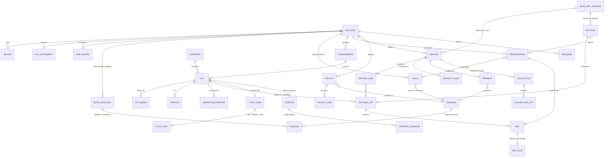
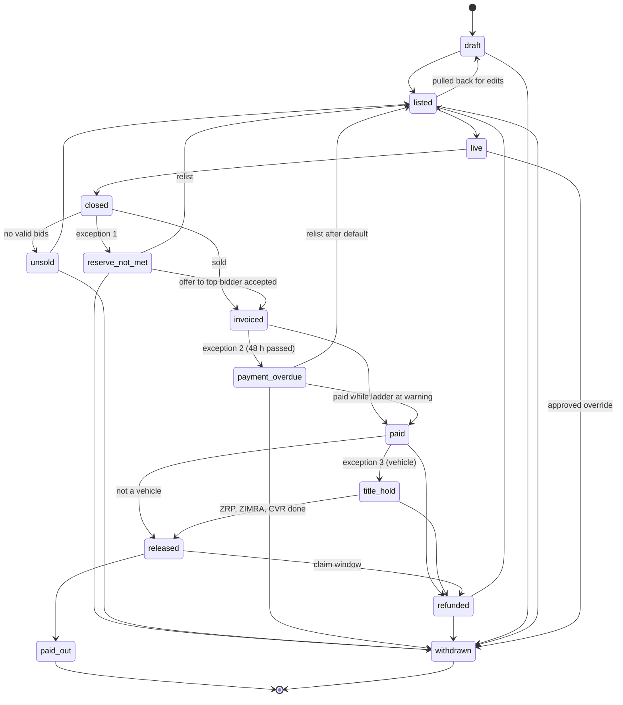

# 02 — Data Model

| | |
|---|---|
| Phase | 0 — Foundations (deliverable 3) |
| Source of truth | Blueprint §8 (entities, lot states, risk controls), §6 (modules), [00 Assumptions register](00-assumptions-register.md) |
| Canonical DDL | [`db/schema.sql`](../db/schema.sql) · reference data [`db/seed.sql`](../db/seed.sql) · invariant tests [`db/tests/invariants.sql`](../db/tests/invariants.sql) |
| Related | [01 Solution architecture](01-solution-architecture.md) |

The blueprint's premise for §8: *"The system stays honest when money, bids and lot states each have one owner and one history."* This document gives each of the twelve entities one owner, shows how the four architecture rules (R1–R4) are enforced by the database itself, and specifies the lot state machine and the trust-tier model.

## 1. The twelve entities and where they live

| # | Entity (blueprint §8) | Holds (blueprint) | Owns this rule (blueprint) | Tables | Owning module |
|---|---|---|---|---|---|
| 1 | Account | Identity, tier, devices, contact consent | Who may bid, and how much | `identity.account`, `device`, `kyc_document`, `link_signal`, `contact_consent`, `staff_role` | Identity and trust |
| 2 | Wallet and ledger entry | Currency, balance, holds, double-entry lines | Every movement of money | `ledger.book_account`, `journal`, `posting`, `hold` | Wallet and ledger |
| 3 | Lot | Category, condition fields, media, reserve, settlement currency, location | What is for sale | `catalogue.lot`, `lot_media`, `vehicle`, `inspection_report`, `category`, vocabulary tables | Catalogue (vehicles: Vehicles module) |
| 4 | Auction | Lot set, schedule, close rules | When and how bidding ends | `auction.auction`, `auction_lot` | Bidding engine |
| 5 | Registration | Account, auction, limit at the time | The right to bid in one auction | `registration.registration`, `limit_override` | Registration |
| 6 | Bid | Amount, proxy ceiling, server time, result. Append-only | Price discovery | `bidding.bid`, `bid_void`, `bid_network` | Bidding engine |
| 7 | Invoice | Hammer, levy, VAT and other tax lines, delivery, due time | What is owed | `settlement.invoice`, `invoice_line`, `default_case`, `default_step` | Close and settlement |
| 8 | Payment | Method, gateway reference, status. Idempotent by reference | Settlement | `payment.payment`, `gateway_event`, `reconciliation_run`, `reconciliation_item` | Payments (inside the ledger boundary) |
| 9 | Collection and title case | Slots, QR pass, agency steps | Release of goods | `logistics.collection`, `collection_lot`, `collection_slot`, `title_case`, `title_step` | Logistics (title: Vehicles module) |
| 10 | Payout | Seller statement, deductions, due date | What is owed to the seller | `payout.payout`, `payout_line`, `destination` | Payouts (inside the ledger boundary) |
| 11 | Dispute | Claim, evidence, decision | Remedies | `support.dispute`, `dispute_evidence` | Support and disputes |
| 12 | Message | Template, channel, delivery status | What the user was told | `comms.message`, `template`, `preference` | Communications |

Supporting tables outside the twelve: `seller.consignment` (needed by Lot and Payout), `rulebook.*` (R2), `audit.*` (R3) and `core.*` (outbox, idempotency keys, branches).

**Ownership rule.** Only the owning module writes its tables. Other modules may hold foreign keys to them, because referential integrity is cheaper than reconciliation, but they never write to them. Admin reports and analytics read the replica.

## 2. Entity-relationship diagram



## 3. Module ownership and schemas

| Schema | Module | Notes |
|---|---|---|
| `core` | Platform | `currency_code` domain (`USD`, `ZWG`), branches, outbox, idempotency keys |
| `audit` | Platform | Append-only `event`; `override_request`; actor context via `audit.set_actor()` |
| `rulebook` | Platform | `rule_set_version`, `rule_value`, `tax_rate`. Semantics in deliverables 04 and 05 |
| `identity` | Identity and trust | Account, devices, ID documents, link signals, consent, staff roles |
| `ledger` | Wallet and ledger | Chart of accounts, journals, postings, holds; `post_journal()` is the only write path |
| `payment`, `payout` | Wallet and ledger boundary | Post money only through `ledger.post_journal()` |
| `seller`, `catalogue` | Seller portal, Catalogue, Vehicles | Consignments, lots, vocabulary, media, vehicles, inspections, saved searches |
| `auction`, `bidding` | Bidding engine | Auctions, auction lots with live bidding state, the bid log |
| `registration` | Registration | Per-auction admission with limit snapshot; approved limit overrides |
| `settlement` | Close and settlement | Invoices, lines, default ladder |
| `logistics` | Logistics, Vehicles | Collections, QR pass, slots, title cases |
| `support` | Support and disputes | Disputes and evidence (tickets: deliverable 17) |
| `comms` | Communications | Templates, messages, preferences |

**Rule versions** (A20). An auction pins `rule_version_id` when it opens. Bidding in that auction (increments, soft close, limit formula) follows that version. Its invoices use the **same pinned version** for fees, plus the tax rates in force **at the hammer**; each tax line references the exact `tax_rate` row used. Changing a rule mid-auction therefore never changes what a bidder was shown or billed (A20, corrected in Phase 3).

## 4. Wallet and ledger

### 4.1 Representation

- Amounts are `bigint` minor units with a `currency` column (A13). A posting is **signed**: positive = debit, negative = credit.
- Each journal is in **one currency**. Composite foreign keys `(journal_id, currency)` and `(book_account_id, currency)` make it impossible to post a ZiG line in a USD journal, or to a ZiG account from a USD journal. That is "never convert silently" (blueprint §7), enforced by the database. A deliberate conversion would be two journals, one per currency, through `fx_clearing`, with a stated rate and an approved override.
- `book_account.balance_minor` is a **cache owned by the ledger**, updated by trigger in the same transaction as the posting. It is not a module's private copy: nothing else may write it, and a direct `UPDATE` is rejected. Its row lock serialises concurrent movements on one account, and `CHECK (allow_negative OR balance_minor >= 0)` makes an overdraw impossible even under concurrency.
- Journals and postings are append-only. A mistake is corrected by a `reversal` journal that points at the original.
- `ledger.post_journal()` is idempotent on its key: a retried call returns the original journal and posts nothing (R4).

### 4.2 Chart of accounts

| Purpose | Owner | Normal side | May go negative | Meaning |
|---|---|---|---|---|
| `wallet_available` | customer, per currency | Credit | No | Money the customer can spend or withdraw to source |
| `wallet_held` | customer, per currency | Credit | No | Deposits held as collateral for bidding |
| `customer_receivable` | customer, per currency | Debit | No | Invoiced and not yet paid |
| `seller_payable` | seller, per currency | Credit | Only for sellers with an `advance` consignment | Proceeds owed to the seller, net of deductions posted so far |
| `gateway_clearing` | gateway, per currency | Debit | Yes | Collected by a gateway, not yet settled to the trust account |
| `trust_bank` | platform, per currency | Debit | No | Designated trust account holding customer funds (Q7) |
| `branch_cash` | branch, per currency | Debit | No | Cash taken at a branch counter, not yet banked |
| `commission_income` | platform | Credit | No | Seller commission (rates: Q3) |
| `fee_income` | platform | Credit | No | Relist fees and other fees |
| `delivery_income` | platform | Credit | No | Delivery charges |
| `forfeiture_income` | platform | Credit | No | Forfeited deposits |
| `tax_payable` (`sub_code` = tax code) | platform | Credit | No | VAT, purchaser's levy, IMTT and so on, owed to the tax authority (Q9) |
| `fx_clearing` | platform | — | Yes | Reserved for explicit, approved conversions; unused by default |
| `suspense` | platform | Debit | Yes | Unmatched reconciliation items; target balance zero at daily close |

Gateway fees deducted on settlement need an expense account; it will be added with the gateway specs in deliverable 9.

**Safeguarding check (PROPOSED, supports Q7).** At each daily close: Σ `wallet_available` + Σ `wallet_held` + Σ `seller_payable` ≤ `trust_bank` + `gateway_clearing` + `branch_cash`, per currency. A breach raises a finance alert, because it would mean customer money had been used for something else.

### 4.3 Posting recipes

Worked example, all USD: a lot sells at a hammer of US$1,000.00. VAT and levy rates are Hammer and Tongues' figures, used here **only as placeholders** (BENCHMARK, Q9). Delivery is US$10.00. Commission at 10 % is purely illustrative (Q3).

| Event | Journal kind | Debit (+) | Credit (−) | Amount |
|---|---|---|---|---|
| Top-up by EcoCash | `top_up` | gateway_clearing:paynow | wallet_available:buyer | 500.00 |
| Gateway settles to trust account | `gateway_settlement` | trust_bank | gateway_clearing:paynow | 500.00 |
| Cash at the Harare counter | `branch_cash` | branch_cash:HRE | wallet_available:buyer | 200.00 |
| Deposit held on registration | `hold` | wallet_available:buyer | wallet_held:buyer | 200.00 |
| Invoice issued at the hammer | `invoice_issued` | customer_receivable:buyer 1,315.00 | seller_payable:seller 1,000.00 · tax_payable:vat 155.00 · tax_payable:purchasers_levy 150.00 · delivery_income 10.00 | 1,315.00 |
| Deposit released to pay | `hold_release` | wallet_held:buyer | wallet_available:buyer | 200.00 |
| One-tap wallet payment | `invoice_payment` | wallet_available:buyer | customer_receivable:buyer | 1,315.00 |
| Commission on a paid lot | `commission` | seller_payable:seller | commission_income | 100.00 |
| Seller payout | `payout` | seller_payable:seller | trust_bank (or gateway_clearing for mobile money) | 900.00 |
| Default ladder: deposit forfeit | `forfeit` | wallet_held:buyer | forfeiture_income (share to seller if the rulebook says so) | 200.00 |
| Default ladder: relist fee | `relist_fee` | wallet_available:buyer, or customer_receivable:buyer if the wallet is short | fee_income | rulebook |
| Unpaid invoice cancelled | `invoice_credit` | seller_payable 1,000.00 · tax_payable lines · delivery_income | customer_receivable:buyer | 1,315.00 |
| Upheld dispute: refund to wallet | `refund` | seller_payable (or a platform account once the seller is paid) | wallet_available:buyer | decided amount |
| Refund back to source | `refund` | wallet_available:buyer | gateway_clearing:paynow | decided amount |
| Any correction | `reversal` | mirror of the original lines | | original |

In the example the buyer topped up US$500.00 and paid US$200.00 cash, but the invoice is US$1,315.00. The wallet payment would therefore be refused (wallet_available cannot go negative) until the buyer tops up the remaining US$615.00. The commit screen would have caught this earlier, because the limit check counts the all-in total against the limit (§6).

### 4.4 Holds

`ledger.hold` records **why** money sits in `wallet_held` and what happened to it (`active` → `released` or `forfeited`). The money itself moves only through the `hold`, `hold_release` and `forfeit` journals the row points to. Daily reconciliation checks that Σ active holds per customer and currency equals that customer's `wallet_held` balance.

## 5. Lot state machine

Blueprint §8: seven states on the main path, three exceptions, each with a named owner and a defined exit. The schema adds a `draft` state for intake (seller portal), an `unsold` state for lots with no valid bid, and a `refunded` state for upheld disputes (PROPOSED, deliverable 17). Allowed transitions are data (`catalogue.lot_state_transition`), and a trigger rejects anything else.



| Exception (blueprint) | State | Owner | Exits | Rules (rulebook keys) |
|---|---|---|---|---|
| Reserve not met | `reserve_not_met` | Ops, with the seller | Offer the top bidder the reserve price (`invoiced`); relist (`listed`); return to seller (`withdrawn`) | `reserve.offer_window_hours` (PROPOSED 24) |
| Not paid in time | `payment_overdue` | Settlement (automatic ladder), Risk for appeals | Late payment while the ladder is at *warning* (`paid`); after forfeit and relist fee, relist (`listed`) or return (`withdrawn`) | `settlement.pay_window_hours = 48` (CONFIRMED); `settlement.reminder_hours = [12, 36]` (PROPOSED); ladder order CONFIRMED in blueprint module 7 |
| Vehicle title | `title_hold` | Vehicle desk | `released` only when the title case is `complete` (all three steps done with evidence) | `vehicle.title_deadline_days = 14` (BENCHMARK: Hammer and Tongues "within two weeks") |

**Enforced by the database** (tested in `db/tests/invariants.sql`):

- A lot is created only in `draft`, and moves only along listed transitions. `paid_out` and `withdrawn` are terminal.
- A vehicle cannot go from `paid` to `released`; it must pass `title_hold`. A non-vehicle cannot enter `title_hold`.
- A vehicle cannot enter `released` unless its `logistics.title_case` is `complete`. A title case cannot be `complete` unless ZRP, ZIMRA and CVR steps are all `done`, and a step cannot be `done` without evidence.
- The vehicle flag must match the lot's category (composite foreign key) and is fixed once the lot leaves `draft`.
- `catalogue.vehicle` records make, model, year, chassis and engine numbers (normalised), registration, odometer, fuel, transmission, colour, documents status, and, from migration `0001`, body style and drive (each from a fixed list) for search filters.
- A collection cannot become `ready` or `released` against an unpaid invoice.
- Every transition writes an `audit.event` with the actor, and fails if no actor was set.

`auction.auction_lot.result` records the outcome of each attempt (`sold`, `reserve_not_met`, `unsold`, `withdrawn`). `catalogue.lot.state` is the lot's single overall state, and `current_auction_lot_id` points at its current or last attempt, so a relisted lot keeps one history across auctions.

## 6. Account tiers and limit composition

### 6.1 Tiers (blueprint module 1: Guest, Verified, Trusted, Restricted)

| Tier | Entry criteria | Can bid? | Registration | Status |
|---|---|---|---|---|
| Guest | Signed up, not verified | No (browse, watch, save searches) | — | Tiers CONFIRMED in the blueprint target; criteria PROPOSED |
| Verified | `partial`: email **and** phone OTP. `full`: partial **plus** ID reviewed | Yes | Auto-approved | Verification levels and their $100 / $500 limits CONFIRMED as ABC's current practice |
| Trusted | Full verification; ≥ 3 invoices paid on time in the last 12 months; no default in 12 months; account ≥ 90 days old; 2FA on | Yes, higher limit | Auto-approved | PROPOSED (A14) |
| Restricted | Default-ladder step 4 (tier drop), or a risk flag (linked to a barred account, payment fraud, a duplicate identity) | Yes, deposit-backed only | **Manual queue** | PROPOSED. Exit: 6 months without default plus staff review (PROPOSED) |

Promotions to Trusted run in a nightly job; demotions happen immediately. Every tier change is audited, and any staff-initiated change is a `tier_change` override.

Database checks: a Guest has no verification; Trusted requires `full`; `partial` and `full` require both OTPs; `full` requires an ID number. ID numbers are unique across accounts (keyed hash), which implements blueprint §8's "ID number uniqueness check".

### 6.2 Spending limit

Limits are computed **per currency** (A12) by the Registration and limits service, from the ledger and the rulebook. Nothing stores a "balance" or "limit" of its own except the registration's **snapshot**, which the blueprint asks for ("limit at the time").

```
limit(account, currency, auction):
  if account.status != active or tier == guest:            return 0
  if active limit_override(account, currency):             return override.limit   -- approved, audited (R3)

  deposit   = Σ active holds(account, currency)            -- from ledger.hold / wallet_held
  multiplier = rule('limit.deposit_multiplier', tier)       -- 10 (CONFIRMED) for verified and trusted; 1 for restricted (PROPOSED)
  base      = 0 if auction.deposit_required or tier == restricted
              else rule('limit.base', verification_level, currency)   -- USD 100 partial / 500 full (CONFIRMED); ZiG set by finance
  uplift    = 0 unless tier == trusted
              else min(rule('limit.history_uplift_pct') × paid_in_full_12m(account, currency),
                       rule('limit.history_uplift_cap', currency))       -- 25 %, US$5,000 cap (PROPOSED)

  limit = max(base, deposit × multiplier) + uplift
  return min(limit, rule('limit.tier_cap', tier, currency))             -- optional; none by default

available_to_bid(account, currency) = limit − exposure
exposure = Σ all-in total at the bidder's proxy ceiling for every live lot they currently lead   (A21)
         + Σ unpaid invoice totals
```

- **Why `max(base, deposit × multiplier)` and not the sum?** The blueprint notes ABC's rules contradict each other: "a $100 or $500 limit beside deposits that lift limits 'from $1'" (gap 6). Taking the larger figure means a deposit always helps and is never double-counted against the free allowance. That matches Copart's model (BENCHMARK: free entry to a small limit, then a deposit of about 10 % of intended bids). The rule is PROPOSED and is a rulebook formula choice, not code.
- **Deposit-required auctions** (vehicles, IT, catering and special auctions: CONFIRMED) ignore the free base: the limit is fully deposit-backed.
- **All-in, not hammer.** Exposure is counted at the all-in total from `QuoteService` (hammer, premium, taxes, delivery), so a bid can never commit a buyer beyond what their deposit covers once tax is added (blueprint module 6: "Check the limit against the all-in figure").
- When a bidder raises their own ceiling on a lot they already lead, the old ceiling for that lot is removed from exposure before the new one is checked.

### 6.3 Worked examples (USD)

| # | Bidder | Auction | Calculation | Limit |
|---|---|---|---|---|
| 1 | Verified, partial, no deposit | General goods | max(100, 0) + 0 | **US$100** |
| 2 | Verified, full, US$30 deposit | General goods | max(500, 30 × 10 = 300) + 0 | **US$500** |
| 3 | Verified, full, US$200 deposit | Vehicles (deposit required) | max(0, 200 × 10) + 0 | **US$2,000** |
| 4 | Trusted, US$500 deposit, US$8,000 paid in 12 months | General goods | max(500, 5,000) + min(25 % × 8,000, 5,000) | **US$7,000** |
| 5 | Restricted after a default, US$300 deposit | General goods | max(0, 300 × 1) + 0 | **US$300** |
| 6 | Example 4's bidder in a ZiG auction with no ZiG deposit | General goods | ZiG base from finance; the USD deposit does not count (A12) | **ZiG base only** |

Example 2 with exposure: the bidder leads one lot with a proxy ceiling of US$300 whose all-in total is US$394.50 (placeholder VAT and levy, plus US$3.00 delivery). Available to bid is US$500 − US$394.50 = **US$105.50**. The commit screen shows: *"You can bid up to US$105.50 more (all-in). Add a deposit to bid higher."*

### 6.4 Registration

One-time verification replaces per-auction approval (blueprint module 2). Joining an auction is one tap:

- **Approved automatically** when the account is Verified or Trusted, active, has no open risk flag and, for deposit-required auctions, holds at least the auction's minimum deposit. `limit_snapshot` records the limit and its composition at that moment.
- **Pending review** only with a non-empty `flag_reasons` (database check): Restricted tier, linked to the seller of any lot in the auction (§8), or a fresh risk signal. Target decision time under 5 minutes (PROPOSED, blueprint module 2).
- Full specification: deliverable 11.

## 7. Notes on the other entities

| Entity | Points that matter |
|---|---|
| **Auction / auction lot** | `auction_lot` carries the live bidding state: current price, leader, `current_end_at`, `extension_count` and `bid_seq`. The engine locks this row per bid, which serialises bids per lot. `reserve_met` is a generated column, so the indicator can never disagree with the price; the reserve figure itself is never sent to bidders. `soft_close_seconds` NULL means "rulebook default"; `experiment_variant` labels the soft-close A/B test |
| **Bid** | Append-only. Every bidder bid carries `client_request_id` (idempotency), its per-lot `sequence_no` (the receipt number), `server_received_at`, the proxy ceiling, and **the all-in total and rule version shown on the commit screen**, so "the screen said X" is provable. Engine-generated proxy bids point at the ceiling bid that produced them. Rejected attempts are logged too. Staff removal is a `bid_void` row backed by an approved override; the bid row itself is never touched. IP and user agent sit in `bid_network`, which can be pruned |
| **Invoice** | One invoice per buyer, auction and currency, so lots won together are billed together. Lines are append-only; corrections are credit notes. The total must equal the sum of the lines (checked at commit). Tax lines must reference the `tax_rate` row used. Line currency must match both the invoice and the auction lot |
| **Payment** | Unique on `(gateway, gateway_reference)` and `(account_id, client_idempotency_key)`. `succeeded` requires a ledger journal. Branch cash requires a receipt number, branch and cashier. InnBucks is USD only (blueprint §7). Every callback is kept verbatim in `gateway_event` with its signature result |
| **Collection / title case** | The QR pass is stored only as a keyed hash. Collections bundle lots per invoice and address. The storage clock start is stored so the invoice can show it |
| **Payout** | `net = gross − deductions`, and the header must match its lines. A new payout destination carries a `cooling_off_until` (step-up re-authentication plus delay, blueprint §8 "Account takeover"). Destination fingerprints also feed `identity.link_signal` |
| **Dispute** | Records both the listed condition and the claimed condition from the fixed vocabulary, so remedies can be tied to the vocabulary (blueprint module 12). A decision requires a decider, a decision text and a remedy |
| **Message** | Unique on `(message_key, channel, recipient)`, where `message_key` is the business event (e.g. `outbid:<bid id>`). A fallback message points at the one it replaces |

## 8. Invariants and where they are enforced

| Invariant | Rule | Enforced by | Test |
|---|---|---|---|
| Journals balance to zero and have ≥ 2 lines | R1 | Deferred constraint trigger | ✔ |
| One currency per journal; posting currency = account currency | R1 | Composite foreign keys | ✔ |
| Non-negative wallets cannot be overdrawn, even concurrently | R1 | `CHECK` on book account + row lock | ✔ |
| Ledger is append-only; balances change only via postings | R1 | Triggers | ✔ |
| Active holds = `wallet_held` balance | R1 | Daily reconciliation job (deliverable 9) | — |
| Safeguarding: customer funds ≤ trust + clearing + cash | R1 / Q7 | Daily reconciliation job (deliverable 9) | — |
| Published rule sets are immutable; publishing needs two people | R2 | Trigger + `CHECK` | ✔ |
| No overlapping active tax rates; rates never edited in place | R2 | Exclusion constraint + trigger | ✔ |
| Commit-screen total equals invoice total for the same inputs | R2 | `QuoteService` shared by both; bid stores quote + version | Phase 1–2 |
| Every state change on bids, payments, lots (and more) is audited with an actor | R3 | Generic audit trigger fails without an actor | ✔ |
| Overrides carry a reason; above threshold, approver ≠ requester | R3 | `CHECK` constraints | ✔ |
| Bid void and limit override require an approved override | R3 | Trigger | ✔ |
| Threshold for two-person approval | R3 | Application, from rulebook `override.two_person_threshold` (A15) | Phase 3 |
| Bids idempotent by client request ID; sequence unique per lot | R4 | Unique constraints | ✔ |
| Payments idempotent by gateway reference and client key | R4 | Unique constraints | ✔ |
| Messages idempotent by (message, channel, recipient) | R4 | Unique constraint | ✔ |
| Lot transitions, vehicle title hold, release only when paid | — | Triggers | ✔ |
| Bid, invoice line and payment currency equal the lot's settlement currency | §7 | Composite foreign keys | ✔ |
| Seller-linked accounts cannot bid on that seller's lots | §8 | Registration service using `identity.link_signal` (deliverables 11, 18) | Phase 3 |

Run the tests: `db/tests/run.sh` (requires a local PostgreSQL 16; uses `PG*` environment variables). It currently runs 61 checks, all passing.

## 9. Personal data classification and retention

Retention periods are **PROPOSED** pending counsel's answer to Q8.

| Data | Where | Class | Protection | Retention (PROPOSED) |
|---|---|---|---|---|
| Name, email, phone | `identity.account` | Personal | Encrypted at rest; masked in admin lists | Life of account + 7 years (financial records), then pseudonymised |
| National ID number | `identity.account` | Sensitive | Keyed hash for uniqueness + envelope-encrypted copy; never logged | As above |
| ID images | Vault bucket via `identity.kyc_document` | Sensitive | Separate bucket, per-object encryption, purpose required, every view audited | 12 months after verification, unless needed for an open dispute or a legal duty |
| Devices, IP addresses | `identity.device`, `bidding.bid_network` | Personal | Fingerprints stored as keyed hashes | 24 months after last use |
| Link signals | `identity.link_signal` | Personal (hashed) | Keyed hashes only | 24 months after last activity |
| Payout and payment details | `payout.destination`, `payment.gateway_event` | Financial | Encrypted details; gateway payloads kept for disputes | 7 years |
| Ledger, invoices, payouts, bids | `ledger.*`, `settlement.*`, `payout.*`, `bidding.bid` | Financial record | Append-only; hold IDs, not personal fields | 7 years |
| Audit log | `audit.event` | Record (includes staff names) | Append-only | 7 years |
| Messages | `comms.message` | Personal | Template parameters minimised | 24 months |
| Location | Not collected by default | Personal | Collected only with a stated purpose (Q8) | Purpose-bound |

Design rule: **append-only tables hold identifiers, not personal details**, so erasure or pseudonymisation of a person never requires editing the ledger, bid log or audit log.
