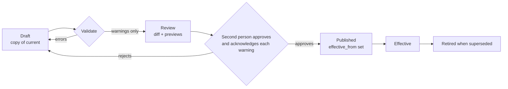

# 03 — Rulebook Service

| | |
|---|---|
| Phase | 1 — Fix the rules (deliverable 4) |
| Source of truth | Blueprint principle 10, §6 "two rules cut across the table", gaps 6–8; [00 Assumptions register](00-assumptions-register.md) |
| Code | [`packages/rules`](../packages/rules/src) · initial rule set [`rulebook/initial-rule-set.json`](../rulebook/initial-rule-set.json) · schema [`db/schema.sql`](../db/schema.sql) (`rulebook.*`) |
| Related | [04 Fee and tax engine](04-fee-tax-engine.md) · [02 Data model §3](02-data-model.md#3-module-ownership-and-schemas) |

## 1. Why the rulebook comes first

Blueprint §9 orders the build "rules first, because every later feature is wrong if the rules contradict each other." Today ABC's rules disagree from page to page (gap 6):

- approval takes 30 minutes in one article and two hours in another
- delivery covers nine towns in one article and seven in another
- a $100 or $500 limit sits beside deposits that lift limits "from $1"

The help desk still promotes "December 2023 Closing Dates" (gap 7), and the rules are spread over six web properties (gap 8).

The rulebook service makes architecture rule **R2** true. It is **one versioned, effective-dated source** for every figure a person sees: limits, fees, taxes, deadlines, soft close and increments. Every screen, message, help page and invoice reads from it. Nothing else in the System may hold a rule value of its own.

**Acceptance test.** A buyer never discovers after a binding bid that a rule was different from what a screen told them, which lowers buyer regret. Sellers and staff stop losing time to contradictory instructions, which shortens time to cash.

## 2. Concepts

| Concept | Meaning | Where it lives |
|---|---|---|
| **Rule key** | A named rule, such as `settlement.pay_window_hours`. Every key is registered with a typed schema, an owner, a section and a plain-language sentence. An unregistered key cannot be published | `packages/rules/src/registry.ts` |
| **Rule record** | One value for one key in one scope, carrying its **provenance** (confirmed, benchmark, proposed, assumption) and a **source** note | `rulebook.rule_value` |
| **Rule set version** | A complete, immutable snapshot of every rule record, with a label and an `effective_from` time | `rulebook.rule_set_version` |
| **Tax rate** | An effective-dated rate for one tax code, tax class and currency. Owned by finance and dated independently of rule set versions, because tax law changes on its own dates | `rulebook.tax_rate` |
| **Snapshot** | A loaded version that answers `get(key, context)`. The same snapshot, identified by version ID, feeds the commit screen and the invoice engine | `RuleSnapshot` in `packages/rules/src/resolve.ts` |

## 3. Rule value types

Each key's schema is one of these types. Validation rejects anything that doesn't match.

| Type | Example key | Value shape |
|---|---|---|
| Duration / count | `settlement.pay_window_hours` | positive integer (hours, seconds or minutes, named in the key) |
| Boolean | `bidding.proxy_enabled` | `true` / `false` |
| Choice | `limit.exposure_basis` | one of a fixed list, e.g. `proxy_ceiling`, `current_price` |
| Basis points | `fees.buyers_premium_bp` | integer, 1550 = 15.5 % |
| **Money per currency** | `override.two_person_threshold` | `{ "USD": 50000, "ZWG": null }` in minor units. `null` means **not yet set**: anything needing that value in that currency is blocked, never guessed |
| Band table | `bidding.increment_ladder`, `commission.schedule` | ascending bands starting at 0, per currency |
| List | `settlement.reminder_offsets_hours` | ordered list |
| Structured | `settlement.default_ladder`, `comms.fallback`, `tier.trusted_criteria` | typed object |

Money per currency is the main defence against silent conversion (blueprint §7). A USD figure is never used for a ZiG lot. Until finance sets the ZiG value, ZiG auctions that need it cannot open.

## 4. Scopes and resolution

A rule record applies globally or to one scope. When several records match, the most specific wins:

| Scope | Specificity | Example |
|---|---|---|
| `global` | 0 | Every key **must** have a global default |
| `currency` | 10 | — (money values are keyed by currency inside the value instead) |
| `tier` | 20 | `limit.deposit_multiplier` = 1 for `restricted` |
| `auction_format` | 30 | a different soft close for floor auctions |
| `branch` | 40 | — (reserved; e.g. branch hours) |
| `category` | 50 + depth | `catalogue.min_photos` = 35 for `vehicles`; a sub-category beats its parent |

Each key declares which scopes it accepts (e.g. `settlement.pay_window_hours` is global only), so a pay window can't quietly differ by tier. Resolution is a pure function of (snapshot, key, context). Context is what the caller knows: currency, tier, auction format, branch and category path.

**Per-auction settings.** An auction may override `bidding.soft_close_seconds` (column `auction.soft_close_seconds`) only with a value from `bidding.soft_close_allowed_seconds`. That's how the 2/5/10-minute test runs (deliverable 8) without letting staff invent values. The bidding service checks this when an auction is scheduled.

## 5. Versioning and effective dating

1. **Copy-on-write.** A new version starts as a copy of the current one; the author edits the copy. Published versions are immutable, which the database enforces (`rulebook.guard_rule_value`, tested).
2. **Which version applies.** At time *t*, the active version is the most recent **published** version whose `effective_from` ≤ *t*. Versions can be published ahead of their effective date, so a change can be announced before it takes effect.
3. **Pinning (A20).** An auction pins the active version **when it opens**. Increments, soft close and the limit formula stay fixed for that auction's life, even if a new version takes effect mid-auction. Invoices use the version active **at the hammer**.
4. **Tax rates are dated separately.** The quote uses the tax rows effective at the hammer time, and each invoice line references the exact `tax_rate` row (`tax_rate_id`). Rates are never edited in place: a change closes the old row (`effective_to`) and inserts a new one (database-enforced). Overlapping active rates are rejected by an exclusion constraint.
5. **Notice period (PROPOSED).** A change that makes things worse for buyers or sellers (a shorter window, a higher fee) takes effect no sooner than **7 days** after publishing, and the "What changed" page lists it. Changes required by law, such as a statutory tax change, take effect on the legal date.
6. **Retiring.** A superseded version is retired and stays readable forever, because invoices and bids reference it.

## 6. Publishing workflow



- **Validation** (`validateRuleSet`, `packages/rules/src/validate.ts`) returns errors and warnings.
  - **Errors block publishing:** unknown key, wrong type, scope not allowed, missing global default, duplicate record, and the cross-rule contradiction checks in §6.1.
  - **Warnings need acknowledgement:** every value whose provenance is *benchmark* or *assumption*, every currency value not yet set, an unpublished commission schedule, and every tax class without an active rate. The approver ticks each warning, and the acknowledgement is stored in the audit log. This is how the System ships with placeholders without ever hiding them.
- **Two people.** The author and approver must be different. The database enforces this (`rule_set_version` check), and the same rule applies to activating a tax rate.
- **Ownership.** Every key has an owning role: finance (tax, commission, fees, money thresholds), operations (timings, delivery, catalogue, vehicles), risk (limits, tiers, deposits, registration, security) or product (messages). Changing a key needs an author from its owning role, and the approver must also hold that role or be an admin.
- **Audit.** Status changes on versions and activation of tax rates are written to `audit.event` by database trigger.

### 6.1 Contradiction checks (the Phase 1 gate)

| Check | Why |
|---|---|
| Payment reminders all fall before the payment deadline, in ascending order | A reminder after the deadline is meaningless |
| Default-ladder steps follow warning → deposit forfeit → relist fee → tier drop, and never go back in time | Blueprint module 7 order |
| Every soft-close value (global or scoped) is one of the allowed test values | Keeps the A/B test honest (deliverable 8) |
| Free storage lasts at least as long as the collection window | Otherwise buyers are charged before their own deadline |
| Increment and commission bands start at 0 and ascend strictly | A gap would leave some prices without a rule |
| Every tax code used by a tax class appears in the calculation order | Otherwise a tax would be skipped |
| Every category's tax class, and the delivery tax class, is defined | Otherwise a lot couldn't be priced |
| Every deposit-required category exists | Catches typos that would silently drop a deposit rule |
| No two active tax rates overlap for the same tax, class and currency | One rate at a time |

Each check has a test in `packages/rules/src/rules.test.ts` that builds a contradictory rule set and asserts it is rejected.

## 7. Read interface

```ts
// In-process (modular monolith), from the Rulebook module
rulebook.activeVersion(at: Date): RuleSnapshot          // most recent published version effective at `at`
rulebook.version(versionId: string): RuleSnapshot       // any version, including retired ones
snapshot.get(key, { currency, tier, auctionFormat, branch, categoryPath })
rulebook.taxRates(at: Date): TaxRateRecord[]            // active rows effective at `at`
```

| HTTP endpoint (public) | Returns |
|---|---|
| `GET /rulebook` | The current version rendered in plain language, with its label and effective date |
| `GET /rulebook/{label}` | Any past version, for disputes ("what were the rules when I bid?") |
| `GET /rulebook/{label}/changes` | Plain-language differences from the previous version |
| `GET /rulebook/{label}/snapshot.json` | The machine-readable snapshot the app caches for offline commit-screen previews |

**Caching.** Versions are immutable, so a snapshot is cached indefinitely by version ID on server and client. Only the "current version" pointer is cached briefly (60 seconds, PROPOSED). The app keeps the snapshot pinned for each auction it shows, so the commit screen can compute totals offline. The server recomputes before accepting any bid, and if the two disagree, **the server's figure is the one used and shown**.

## 8. One rulebook, rendered everywhere

`renderRulebook(snapshot)` (`packages/rules/src/render.ts`) turns every rule into a plain-language sentence, grouped into ten sections. Scoped overrides are listed beside the default (e.g. "Vehicles: every lot has at least 35 photos."). Internal rules (tax calculation order, the soft-close test values, delivery's tax class) appear only in the staff view, and rules that depend on a switched-off rule (storage rates while storage is off) are hidden. Category names come from the catalogue. Every channel shows the rules from this one output:

| Channel | How it uses the rulebook |
|---|---|
| Website and PWA rules page | Renders the current version with its label and date |
| App | Same rendering; also cached per auction |
| WhatsApp help replies | Template parameters are filled from the rendered sentences |
| Help desk | Rule articles are **generated** from the rendering on each publish, replacing hand-written copies (gap 7) |
| Commit screen, invoices, reminders | Read figures through the snapshot and `QuoteService`, never from copy |

Example output from the initial rule set (tested):

> **Time to pay.** Pay within 48 hours of the invoice.
> **If you do not pay in time.** When the time to pay runs out, you get a warning; 24 hours after that, your deposit is forfeited and the lot is offered again; 24 hours after that, a relisting fee is charged; 24 hours after that, your account becomes Restricted.
> **Free allowance by verification.** Email and phone verified: US$100.00 (ZiG amount not yet set). ID verified as well: US$500.00 (ZiG amount not yet set).
> **Bid increments.** Each bid must beat the current price by at least US$1.00 under US$50.00, US$5.00 from US$50.00, US$10.00 from US$200.00, US$50.00 from US$1,000.00, US$100.00 from US$5,000.00, US$250.00 from US$20,000.00. ZiG increments are not yet set.
> **Seller commission.** Commission rates are being confirmed and will be published here.

## 9. Admin console needs

| Screen | Must do |
|---|---|
| Versions list | Show draft, published, effective and retired versions with labels, effective dates, authors and approvers |
| Draft editor | Typed editors per rule type: band tables, money-per-currency pairs, lists, choices. Show provenance and source per record, and require a source note for every change |
| Validation panel | Live errors and warnings as the draft is edited |
| Diff | Changes from the current version, rendered both as data and as plain-language sentences |
| Previews | "What bidders will see": sample commit-screen totals, a sample invoice, a sample limit calculation and the rendered rules page, all computed with the draft |
| Approval | A second person approves; every warning is acknowledged individually; an effective date is chosen and checked against the notice period |
| Impact | Lists open auctions that stay pinned to the old version and scheduled auctions that will pick up the new one |
| Tax rates | Finance-only: add a dated rate, close a rate, and activate with two-person approval |

## 10. The initial rule set

`rulebook/initial-rule-set.json` holds **66 records over 61 keys** transcribed from the blueprint: 10 confirmed, 42 proposed, 8 assumption and 6 benchmark. Phase 2 added the proxy, soft-close and photo-standard rules. Each record carries its provenance and source. It validates with **no errors**. Loading it with `pnpm rulebook:sql | psql` creates a **draft** version, plus five tax rates as **inactive** placeholders; publishing stays a two-person step.

Headline values (full list in the JSON):

| Rule | Value | Provenance | Source |
|---|---|---|---|
| Soft close | 10 minutes; allowed test values 2, 5, 10 minutes | Confirmed; test values proposed | Blueprint §2 module 5; §6 module 5 |
| Soft-close trigger window | last 10 minutes | Assumption (A23) | Not documented |
| Staggered ends | 60 s apart | Proposed | Staggering confirmed, interval not |
| Increment ladder (USD) | US$1 under US$50; US$5 to US$200; US$10 to US$1,000; US$50 to US$5,000; US$100 to US$20,000; US$250 above | Assumption (A23) | ABC's table not in the blueprint. ZiG ladder unset |
| Bid withdrawal | Staff only, with reason and approval | Proposed | No cancellations confirmed; §6 module 5 |
| Auto-approval; review target | On; under 5 minutes | Proposed | §6 module 2 |
| Free allowance | US$100 partial, US$500 full verification | Confirmed | §2 module 1 |
| Deposit multiplier | 10× (Restricted 1×) | Confirmed (Restricted proposed) | §2 module 4 |
| Trusted history bonus | 25 % of 12-month paid total, capped at US$5,000 | Proposed (A14) | Principle 3 |
| Deposit-required categories | vehicles, IT, catering, special | Confirmed | §2 module 4 |
| Minimum deposit | US$500 goods, US$3,000 vehicles | Benchmark (A27) | Hammer and Tongues |
| Pay and collect windows | 48 h and 48 h | Confirmed | §1 cash cycle |
| Reminders | 12 h and 36 h | Proposed | §6 module 7 |
| Default ladder | warning at deadline; forfeit, relist fee and tier drop 24 h later | Order proposed by the blueprint; timing proposed (A25) | §6 module 7 |
| Relist fee | 10 % of hammer, minimum US$10 | Proposed (A26) | Blueprint names no amount |
| Buyer's premium | 0 % | Confirmed absence | §1 |
| Commission | Not set: payouts blocked | Assumption (Q3) | Published as an image |
| Tax classes and order | Levy then VAT; ZW-registered used vehicles VAT-exempt | Benchmark / assumption (Q9) | Hammer and Tongues |
| Delivery | Cut-off 14:30, no vehicles; rate card empty | Confirmed; rate card assumption (A24) | §2 module 8; gap 6 |
| Storage | Off; free 48 h; 1 % a day if enabled | Proposed; rate benchmark (Q4) | Reported only |
| Minimum photos | 4 per lot; 35 for vehicles | Proposed; vehicles benchmark (D2, A28) | Principle 6; Ritchie Bros |
| Two-person override threshold | US$500 | Assumption (A15) | §8, no figure |

### 10.1 What still blocks the Phase 1 gate

Blueprint gate: **"one rulebook, no contradictions."** The contradictions are resolved (§11), and the rule set validates without errors. Publishing for real means the approver acknowledges 32 warnings, each a placeholder or unset value with a named owner. Replacing them with confirmed values clears the warnings. The three that block the most:

1. **Commission schedule (Q3).** Seller payouts cannot be calculated.
2. **Tax rates and classes (Q9).** No lot can go live until finance activates rates (enforced by the quote service; see [04 §6](04-fee-tax-engine.md#6-tax-applicability)).
3. **Increment ladder and all ZiG values (A23, A12).** ZiG auctions cannot open.

## 11. Contradictions resolved

| Contradiction (blueprint) | Resolution in the rulebook |
|---|---|
| Approval takes 30 minutes or two hours (gap 6) | Replaced by `registration.auto_approve` plus a 5-minute target for the flagged queue (`registration.target_decision_minutes`) |
| Delivery to nine towns or seven (gap 6) | One list: the towns in `delivery.rate_card`. Empty until operations confirms (A24); the rendered page then lists exactly those towns |
| $100 / $500 limit beside deposits that lift limits "from $1" (gap 6) | One formula, `limit.formula = max_of_base_and_deposit` ([02 §6.2](02-data-model.md#62-spending-limit)) |
| Stale "December 2023 Closing Dates" and unanswered comment threads (gap 7) | Help-desk rule articles are generated from the rulebook on publish; disputes and tickets move to deliverable 17 |
| Rules scattered over six properties (gap 8) | `GET /rulebook` is the single published source with a version label and date (principle 10) |

## 12. Code map

| File | Purpose |
|---|---|
| `packages/rules/src/registry.ts` | Every rule key: schema, owner, section, allowed scopes, plain-language sentence |
| `packages/rules/src/resolve.ts` | `RuleSnapshot`: loads and type-checks a version, resolves by scope specificity |
| `packages/rules/src/validate.ts` | Publish-time validation: errors and acknowledgement warnings |
| `packages/rules/src/increments.ts` | Increment ladder: minimum next bid, bid check, quick-bid steps |
| `packages/rules/src/render.ts` | Plain-language rulebook for every channel |
| `packages/rules/src/cli/to-sql.ts` | Loads a rule set document into the database as a draft; refuses invalid documents |
| `packages/rules/src/rules.test.ts` | 30 tests covering the initial rule set, each contradiction check, resolution, increments and rendering |
