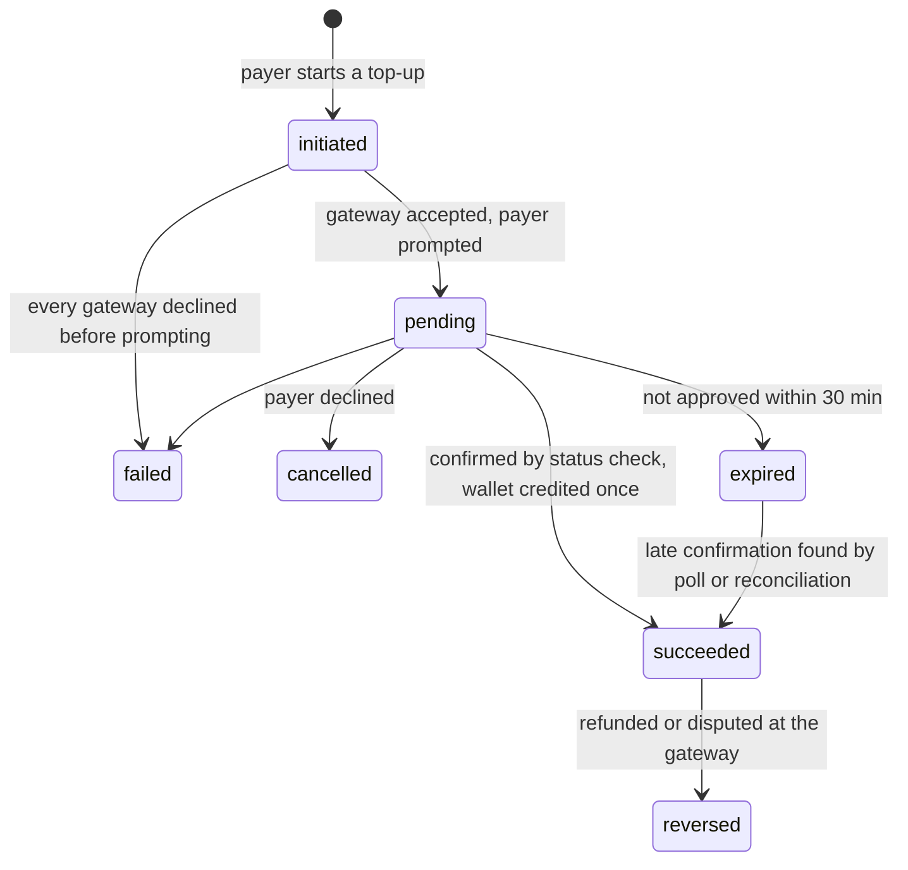

# 09 — Payments Integration

| | |
|---|---|
| Phase | 3 — Money (deliverable 10) |
| Source of truth | Blueprint gap 1, §6 module 3, §7 (mobile money, rails by currency, cash fallback), §8 (payment fraud), §9 build-or-buy ("Payment gateway: Buy") and risks (gateway outages); [00 Assumptions register](00-assumptions-register.md) Q2, Q7, Q9, A17 |
| Code | [`packages/payments`](../packages/payments/src): `gateway.ts` (interface, routing, status rules), `service.ts`, `reconcile.ts`, `paynow.ts` (unverified), `fake.ts` (tests and local) |
| Related | [08 Wallet and ledger](08-wallet-ledger.md) · [11 Close and settlement](11-close-settlement.md) · [01 §7.1](01-solution-architecture.md#71-paymentgateway) |

## 1. Purpose

ABC's online deposits are cash at an office or cash pickup by courier, and a 2023 request for bank deposits went unanswered (gap 1). Meanwhile Paynow connects Visa, Mastercard, EcoCash, OneMoney, InnBucks, Zimswitch and Omari in USD and ZiG, and ABC's rival already runs wallets topped up through ContiPay (blueprint §7).

This module buys those rails rather than building them, and puts two gateways behind one interface from the start.

**Acceptance test.** Buyers pay deposits and invoices from their phones in minutes instead of visiting an office in a 9-to-3 window (lower regret). Payments clear the same day (shorter time to cash).

## 2. One path for money in

**Every payment from outside lands in the payer's wallet as a top-up.** An invoice is then paid from the wallet in one tap ([11 §6](11-close-settlement.md#6-one-tap-payment)). Paying an invoice by EcoCash is simply "top up, then pay", done in one flow on the phone.

This keeps one crediting path whatever the rail, one idempotency rule, one reconciliation and one ledger recipe. Splitting a payment across wallet and mobile money is also trivial: the wallet just needs enough.

## 3. The gateway abstraction

```ts
interface PaymentGateway {
  id: string;
  capabilities(): Capability[];                 // currency × method × min/max amount
  isHealthy(): boolean;
  initiate(req): Promise<InitiateResult>;      // phone prompt or redirect
  status(ref, currency): Promise<StatusResult>; // server-to-server check
  verifyCallback(headers, rawBody): VerifiedCallback | null;
  statement?(date, currency): Promise<StatementLine[]>;
}
```

| Implementation | Status | Notes |
|---|---|---|
| **Paynow** (`paynow.ts`) | **Unverified (A32)** | Written from Paynow's public integration format: URL-encoded messages, an upper-case SHA-512 hash of the values plus the integration key, remote transaction for mobile money, a redirect for cards, and a poll URL for status. One integration per currency. It must pass Paynow's sandbox in USD and ZiG before it is registered in production |
| **ContiPay** | **Not built (A33)** | Interface slot reserved; adapter written when ContiPay's API documentation and sandbox are available |
| **Fake** (`fake.ts`) | Tests and local only | Behaves like a mobile-money gateway: prompt, approve or decline, signed callback, statement |

**Cards.** Card payments always use the gateway's hosted page (redirect), with 3-D Secure performed by the gateway. Card numbers never touch the System, which keeps PCI scope to the minimum. The blueprint notes that Paynow's express checkout is not available for cards, so the redirect step is planned.

## 4. Routing: which gateway, which methods

The rule `payments.routing` lists, per currency and method, the gateways in failover order. A gateway is used only if it is registered, healthy, and accepts the currency, method and amount (`route()`).

| Method | USD | ZiG | Source |
|---|---|---|---|
| EcoCash | Paynow → ContiPay | Paynow → ContiPay | Blueprint §7 (both gateways) |
| OneMoney | Paynow → ContiPay | Paynow → ContiPay | Blueprint §7 |
| InnBucks | Paynow | **not offered** | "InnBucks is USD only" (blueprint §7) |
| Omari | Paynow | Paynow | "Omari and Zimswitch handle both" |
| Zimswitch | Paynow | Paynow | Same |
| Card | Paynow → ContiPay | Paynow | Blueprint §7 |
| Bank transfer | not yet | not yet | No rail chosen (Q2) |
| Branch cash | Counter | Counter | Cash fallback (principle 2) |

The whole table is tagged **assumption** (A17) until gateway contracts confirm methods, limits and order. The payment screen offers only the methods valid for the invoice's currency (`methodsFor`); the database also refuses InnBucks in ZiG.

## 5. Payment lifecycle



Allowed changes are coded in `canTransition` and tested. A late confirmation after expiry is still credited, because the payer's money did move.

## 6. Failover without double charges

- A gateway that refuses a payment **before the payer is prompted** throws `GatewayDeclinedError`, and the service tries the next gateway. Examples: service down, a currency not configured, an amount over its limit.
- **Any other failure** (timeout, garbled reply) means the payer *may* have seen a prompt, so the service **never fails over**. It records the unknown outcome, tells the payer to check their wallet before trying again, and leaves the rest to polling and reconciliation.
- A retried start with the same client key returns the same payment (unique `(account_id, client_idempotency_key)`).

## 7. Callbacks: verify, record, confirm, credit once

1. **Record verbatim.** Every callback is stored in `payment.gateway_event` with its SHA-256 and signature result, whether or not it verifies.
2. **Verify the signature.** A forged callback is rejected; that is tested.
3. **Confirm server to server.** The service calls `status()` on the gateway. The callback body alone is never trusted.
4. **Credit once.** Inside a transaction, with the payment row locked, the service:
   - posts `topUp` with key `payment:<id>`
   - marks the payment succeeded
   - leaves the database's unique `(gateway, gateway_reference)` to stop a second payment claiming the same gateway transaction

   A retried callback finds the payment already succeeded and does nothing.
5. **Amounts must match.** If the gateway reports a different amount or currency from what the payer started, nothing is credited. The payment is flagged for finance, and reconciliation shows it as an exception (tested).

## 8. Polling, expiry and branch cash

- **Polling.** `pollPending()` checks every pending payment with its gateway, which catches callbacks that never arrived (tested). After `payments.pending_expiry_minutes` (30, PROPOSED) a still-pending payment is marked expired.
- **Branch cash.** A cashier records cash with the branch, the cashier's identity and the **receipt number**, which is unique, so the same receipt can't be posted twice. It posts `branchCash` to the same ledger. Counter hours are the branches' (CONFIRMED: 9am–3pm weekdays, 9am–12pm Saturdays); the blueprint suggests agent points and longer counter hours before the cash route is narrowed.

## 9. Daily reconciliation

`reconcileDay(gateway, currency, date)` compares the gateway's statement with the payments recorded as succeeded that day and stores the run with one line per item.

| Outcome | Meaning | Finance action |
|---|---|---|
| `matched` | Same reference, amount and currency | None |
| `amount_mismatch` / `currency_mismatch` | Both sides have it, figures differ | Investigate; correct with a reversal or adjustment |
| `missing_in_system` | The gateway took money the System never credited | Credit the payer after checking, or refund |
| `missing_at_source` | The System credited money the gateway doesn't show | Urgent: possible fraud or gateway error |

A run is `balanced` or `exceptions`. Exceptions go to the finance queue in the admin console (deliverable 18). Paynow's statement feed is not yet confirmed; until it is, its report export is imported into the same reconciliation.

## 10. Taxes on transfers (IMTT)

The Intermediated Money Transfer Tax applies to transfers, not goods (blueprint §7, noting Hammer and Tongues). Whether ABC must levy it on top-ups, payments or refunds, and who bears it, is **Q9** for finance. The fee engine already treats `imtt` as a transfer tax kept out of lot quotes ([04 §3.1](04-fee-tax-engine.md#31-tax-bases)). If finance decides it applies, it attaches at this layer: shown before the payer confirms, posted as its own line to `tax_payable:imtt`.

## 11. Security

| Control | How |
|---|---|
| Callback authenticity | Signature verification plus a server-to-server status check |
| Secrets | One integration id and key per currency, held in the secrets manager; never in the repository |
| Card data | Never handled; gateway-hosted pages with 3-D Secure |
| Replay and duplicates | Unique gateway references; idempotent crediting; every callback kept for audit |
| Fraud signals | Payment-source fingerprints are to be written to `identity.link_signal` for the shill and duplicate-identity checks; the writer is part of deliverable 18 (not built yet) |

## 12. Evidence

| Behaviour | Test (`payments.test.ts`) |
|---|---|
| Routing order, health, amount limits; InnBucks USD only | Routing tests |
| Forward-only status changes; late confirmation credits | `canTransition` test |
| EcoCash top-up credited once despite a retried callback | Database test |
| Failover only on a pre-prompt decline | Database test |
| Forged callback rejected and recorded | Database test |
| Different amount never credited | Database test |
| Lost callback recovered by polling; stale payments expire | Database test |
| Branch cash posted once per receipt | Database test |
| Reconciliation finds matched, missing and mismatched items | Pure and database tests |
| Paynow hashing, request, decline versus forged reply, callback verification | Adapter tests (format only; sandbox pending) |

## 13. Open items

| Item | Owner | Effect until decided |
|---|---|---|
| Q7: authorisation for holding balances | Counsel | Public launch waits; trust-account default |
| A17: gateway contracts, methods, limits and order | ABC Finance | Routing table as in §4 |
| A32: verify the Paynow adapter in the sandbox (USD and ZiG) | Tech lead | Adapter not registered in production |
| A33: ContiPay API documentation and sandbox | ABC Finance / tech lead | No failover gateway in production until built |
| Q9: IMTT on transfers | ABC Finance | Not charged |
| Q2: bank transfer rail | ABC Finance | Not offered |
