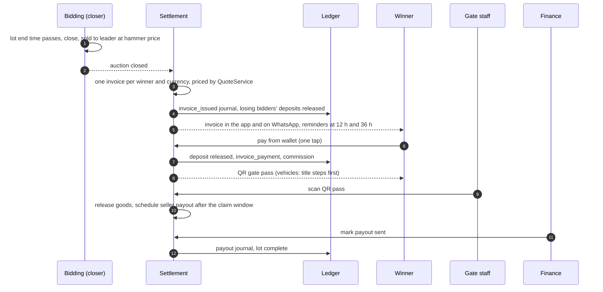

# 11 — Close and Settlement

| | |
|---|---|
| Phase | 3 — Money (deliverable 12) |
| Source of truth | Blueprint gap 2, §1 cash cycle (CONFIRMED: Buyer's Report the next morning, 48 hours to pay, 48 to collect), §6 module 7 ("Invoice issued at close, in the app and by WhatsApp. Pay from wallet in one tap. Reminders. Default ladder"), module 10 (QR pass, storage clock), §8 lot states and non-payment control |
| Code | [`packages/settlement`](../packages/settlement/src): `settlement.ts` (pure: invoices, reminders, ladder, gate pass, payout date), `service.ts` (`SettlementService`) · closing: [`packages/bidding`](../packages/bidding/src/service.ts) `closeDueLots` |
| Related | [08 Wallet and ledger](08-wallet-ledger.md) · [09 Payments](09-payments.md) · [02 §5 lot states](02-data-model.md#5-lot-state-machine) |

## 1. Purpose

Today an online auction closes in the evening and the Buyer's Report, with VAT and levy, arrives by email the next morning. The buyer has 48 hours to pay and 48 more to collect, and the seller is paid only afterwards (blueprint §1).

The target issues the invoice **at the close**, lets the buyer pay **in one tap**, and turns payment straight into a **gate pass** and a **scheduled payout**.

**Acceptance test.** Hammer-to-payment time drops (the invoice is ready at once, reminders follow, paying is one tap), and the seller's payout date is known at release, which shortens time to cash. The invoice matches the commit screen exactly, which lowers regret.

## 2. The flow

## 3. Closing

`BiddingService.closeDueLots` is meant to run every second from the worker process; the scheduler arrives with the API app. It locks each lot whose end time has passed, re-checks the end time (a last-second bid may have extended it), and records the result:
- `sold`, with winner and hammer price
- `reserve_not_met`
- `unsold`

Lot states follow the state machine. When an auction's last lot closes, the auction is marked closed.

## 4. Invoices at the close

`settleClosedAuction` (idempotent: running it twice issues nothing new):

1. **One invoice per winner and currency.** Lots won together are billed together; a ZiG lot and a USD lot become two invoices, never a conversion.
2. **Same prices as the commit screen.** Each lot is priced by `quoteLot` with **the auction's pinned rule set** and **the tax rates in force at that lot's hammer** (A20, corrected). Each line keeps its base, rate and tax-rate row. The invoice total equals the sum of its lines (database check).
3. **Deadlines.** Due `settlement.pay_window_hours` (48, CONFIRMED) after issue. Collect within `settlement.collect_window_hours` (48, CONFIRMED) after that. The storage clock is shown on the invoice (module 10).
4. **Ledger.** The `invoice_issued` journal: the buyer owes the total; the seller, the tax authority and ABC are owed their parts.
5. **Lots** move to `invoiced`. An `invoice.issued` event goes to the communications layer for in-app and WhatsApp delivery, with email as the record.

Example (placeholder rates, BENCHMARK): hammer US$260.00, levy US$39.00, VAT US$40.30, **total US$339.30**. This is scenario A in the tests.

## 5. Deposits at settlement

- Bidders who **won nothing** get their deposit released to their wallet immediately (`deposit.release_on = auction_settled`).
- **Winners** keep their deposit held until they pay; it then counts towards the payment (§6).

## 6. One-tap payment

`payFromWallet` does the following in one transaction:

1. Releases the buyer's deposit for that auction into their available balance.
2. Checks the available balance covers the invoice. **If it doesn't, nothing changes:** the deposit stays held, and the buyer is told the shortfall, e.g. *"You need US$313.50 more. Top up with EcoCash, OneMoney … or pay at a branch."* Only methods valid for the invoice currency are offered ([09 §4](09-payments.md#4-routing-which-gateway-which-methods)). Tested in scenario B.
3. Posts `invoice_payment` and records the payment (method `wallet`, idempotent by client key: a second tap returns the first result).
4. Marks the invoice paid and recognises **commission** per lot. If commission is unpublished (Q3), none is posted and the payout waits.
5. Lots move to `paid`. **Vehicles** move to `title_hold` and get a title case with three steps (ZRP, ZIMRA, CVR), due by `vehicle.title_deadline_days`.
6. Creates the collection with a **QR gate pass**.

## 7. The gate pass

- The pass is a random token shown as a QR code in the app. **Only its keyed hash is stored**, so a database leak doesn't leak working passes.
- Staff scan it with `releaseAtGate`:
  - unknown pass → `invalid_pass`
  - already used → `not_ready`
  - vehicle with an incomplete title case → `title_incomplete`, refused by the database's lot-state rule even if the application forgot to check
- On release: lots move to `released`, the collection records who released it and when, and payouts are scheduled (§10). Tested in scenarios A and C.
- Slot booking, delivery and bundling by address extend this in Phase 5 (deliverable 15).

## 8. Reminders

`queueDueReminders` emits one `invoice.reminder` event per offset in `settlement.reminder_offsets_hours` (12 h and 36 h, PROPOSED), **once each**, while the invoice is unpaid. The communications layer sends them by WhatsApp, falling back to push and SMS (rule `comms.fallback`). Tested: none at 11 h, one at 13 h, none more at 14 h, one at 37 h.

## 9. The default ladder

`runDefaultLadder` is safe to run as often as wanted; each step applies once (`settlement.default_step` is unique per case and step).

| When (rule `settlement.default_ladder`) | Step | What happens | Ledger |
|---|---|---|---|
| At the 48-hour deadline | **Warning** | Invoice → `overdue`, lots → `payment_overdue`, warning message | — |
| 24 h later (PROPOSED, A25) | **Deposit forfeit** | Deposit forfeited (a share to the seller if `settlement.forfeit_seller_share_bp` > 0 and there is one seller). Invoice cancelled → `defaulted`. Lots back to `listed` for relisting | `forfeit`, `invoice_credit` |
| Same time | **Relist fee** | 10 % of hammer, minimum US$10 (PROPOSED, A26). Taken from the wallet if it can cover it; otherwise owed | `relist_fee` |
| Same time | **Tier drop** | Account → Restricted: limit becomes deposit × 1, registrations go to review | — |

Scenario B tests the whole ladder: a US$700 lot unpaid, US$500 deposit forfeited, invoice cancelled, US$70 relist fee from the wallet, Bob Restricted, lot back on sale, books reconciled.

**Appeals (not built yet).** The design lets risk staff waive a step before it runs: an override of type `deposit_forfeit_waiver`, with a reason and a second approver above the threshold, after which the ladder skips that step and the default case closes as `waived`. The schema already has the override type and the `waived` status; the ladder check and the admin screen come with deliverable 18. Until then the ladder runs every step.

## 10. Payouts after release

At release, one payout per seller and currency is scheduled. Gross is the hammer; deductions are commission. It is due after the claim window plus processing time ([08 §7](08-wallet-ledger.md#7-payouts)).

Scenario A: US$260.00 hammer, US$26.00 commission (illustrative 10 %), US$234.00 net, paid from the trust account after the gateway settled. The lot's audit trail runs `draft → listed → live → closed → invoiced → paid → released → paid_out`.

## 11. Measures instrumented

| Blueprint measure (§9) | Events |
|---|---|
| Time from hammer to payment | `lot.closed` → `invoice.paid` |
| Share of deposits and winnings paid in-app | `payment` rows by method (`wallet`, mobile money, card, `branch_cash`) |
| Default rate and recovery rate | `default.warning`, `default_step` rows, relist outcomes |
| Time from sale to seller payout | `lot.closed` → `payout.paid` |

## 12. Evidence (`money-path.test.ts`, against PostgreSQL)

| Scenario | Proves |
|---|---|
| **A** | EcoCash and branch-cash money in → one-tap deposit-auction join (limits = deposit × 10) → proxy bidding → close → invoice at close (US$339.30, itemised) → losers' deposits back → one-tap pay using the deposit → commission → QR release (forged and reused passes refused) → payout scheduled after the claim window → gateway settles to the trust account → seller paid → full lot audit trail → books reconcile |
| **B** | Insufficient funds leave everything unchanged → reminders once each → warning at the deadline → forfeit, cancel, relist fee and tier drop 24 h later → Restricted limit → books reconcile |
| **C** | Vehicle paid → held at the gate until ZRP, ZIMRA and CVR steps are evidenced → released → books reconcile |

## 13. Open items

| Item | Owner | Effect until decided |
|---|---|---|
| Q3: commission rates | ABC Commercial | Payouts blocked (tests use an illustrative 10 %) |
| Q9: tax rates | ABC Finance | No lot can go live; tests activate placeholders |
| A25: ladder timing | ABC Operations / Risk | As in §9 |
| A26: relist fee | ABC Commercial | 10 %, minimum US$10 |
| Q4: storage fees after the collection window | ABC Operations | Storage clock shown; no charge |
